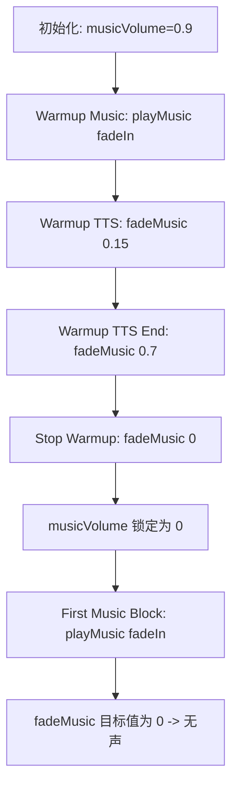

# RadioNowhere 音乐播放无声问题 - 深度诊断报告

## 问题现象确认
根据反馈与代码审查，该问题表现为：
1. **预热阶段正常**：背景音乐和 TTS 问候语能正常叠加播放，证明 `audioMixer` 基础功能、Web Audio 上下文及 Howler 实例正常。
2. **主节目音乐无声**：预热结束后，进入正式节目（Music Block）时，虽然日志显示音乐加载成功，但实际没有声音。
3. **TTS 正常**：后续的 Talk Block 仍有声音，说明 `voiceHowl` 轨道正常，问题局限在 `musicHowl` 轨道的音量调度。

## 音量状态转移追踪

### warmup → main 阶段的音量变化流程



1.  **[初始化]** `audioMixer.musicVolume` = 0.9 (默认值)。
2.  **[预热开始]** `playWarmupContent` 调用 `playMusicFromSearch` -> 最终调用 `playMusic` 播放背景音乐。
3.  **[预热 TTS 叠加]** 
    *   调用 `audioMixer.fadeMusic(0.15, 500)` -> `musicVolume` 变为 **0.15**。
    *   TTS 播放完毕后，调用 `audioMixer.fadeMusic(0.7, 1000)` -> `musicVolume` 变为 **0.7**。
4.  **[预热过渡到主节目]** (位于 `director_agent.ts` L152-153)
    *   执行 `await audioMixer.fadeMusic(0, 1500)` -> **关键点**：此时 `audioMixer.musicVolume` 被更新为 **0**。
    *   执行 `audioMixer.stopAll()` -> 停止并卸载 `musicHowl` 实例，但 **`musicVolume` 内部状态保留为 0**。
5.  **[首个 Music Block 播放]** (位于 `director_agent.ts` L1333)
    *   调用 `audioMixer.playMusic(url, { fadeIn: 2000 })`。
    *   `playMusic` (L102) 内部：`const startVolume = options?.fadeIn ? 0 : this.musicVolume;` -> `startVolume` 为 0。
    *   `playMusic` (L143) 内部：`void this.fadeMusic(this.musicVolume, options.fadeIn);`
    *   **由于此时 `this.musicVolume` 是 0，音乐从 0 淡入到 0，导致全程无声。**

## 代码审查发现

### 1. 音量状态污染
在 `audioMixer.ts` 中，`this.musicVolume` 既被用作当前 Howl 实例的音量控制，又被用作下一次播放的"目标音量"或"恢复音量"。
```typescript
// audio_mixer.ts L221
this.musicVolume = targetVolume;
```
当执行 `fadeMusic(0, duration)` 用于淡出停止音乐时，它副作用地修改了全局的音乐音量设定。

### 2. 缺乏重置机制
在 `director_agent.ts` 的 `runShowLoop` 中，从 warmup 切换到 main timeline 时，没有显式重置 `audioMixer` 音量的步骤。
```typescript
// director_agent.ts L151-154
await audioMixer.fadeMusic(0, 1500);
audioMixer.stopAll();
await this.delay(300);
// 此处缺失 audioMixer.setMusicVolume(AUDIO.MUSIC_DEFAULT_VOLUME);
```

### 3. `playMusic` 的逻辑陷阱
```typescript
// audio_mixer.ts L142-144
if (options?.fadeIn) {
    void this.fadeMusic(this.musicVolume, options.fadeIn);
}
```
如果 `this.musicVolume` 因为之前的淡出操作变成了 0，那么后续所有的 `fadeIn` 都会失效（淡入到 0）。

## 音量控制调用点清单

### setMusicVolume 调用点
1. `audio_mixer.ts` L231: 方法定义，更新 `this.musicVolume` 并同步到 `musicHowl`。
2. `director_agent.ts` L317: `playTransitionMusic` 播放过渡音乐前设置为 `TRANSITION.MUSIC_VOLUME` (0.5)。
3. `director_agent.ts` L336: `playTransitionMusic` 结束后恢复为 `AUDIO.MUSIC_AFTER_TRANSITION` (0.8)。
4. `director_agent.ts` L1121: `executeTalkBlock` 中根据指令设置音量。

### fadeMusic 调用点
1. `audio_mixer.ts` L143: `playMusic` 内部实现淡入效果，目标值为 `this.musicVolume`。
2. `audio_mixer.ts` L357: `overlayVoice` 内部降低音乐音量。
3. `audio_mixer.ts` L365: `overlayVoice` 结束后恢复音乐音量。
4. `director_agent.ts` L152: 预热结束时淡出音乐（目标值 0）。
5. `director_agent.ts` L180: 备选生成逻辑中淡出音乐（目标值 0）。
6. `director_agent.ts` L281/283: 预热 TTS 播放时的压低和恢复。
7. `director_agent.ts` L332: 过渡音乐淡出（目标值 0）。
8. `director_agent.ts` L1114/1157: Talk Block 中背景音乐淡出和恢复。
9. `director_agent.ts` L1297/1347: Music Block 播放结束淡出。
10. `director_agent.ts` L1370/1375: Music Control 指令执行。

## 根本原因分析

**核心原因：音量状态持久化与淡出操作的冲突。**
`AudioMixer` 错误地将淡出至 0 的操作记录为用户的音量偏好（`musicVolume`）。由于 `DirectorAgent` 在 warmup 结束时使用了淡出过渡，导致整个系统进入了"静音偏好"模式。后续播放逻辑盲目信任该偏好，导致所有带淡入效果的音乐都在音量为 0 的状态下运行。

## 修复方向建议

### 方案 A：在调度层重置（推荐）
在 `director_agent.ts` 的 `runShowLoop` 中，在 warmup 结束后的清理阶段增加音量重置逻辑。
```typescript
await audioMixer.fadeMusic(0, 1500);
audioMixer.stopAll();
audioMixer.setMusicVolume(AUDIO.MUSIC_DEFAULT_VOLUME); // 强制恢复默认音量
```

### 方案 B：改进 Mixer 的淡入逻辑
在 `audioMixer.ts` 的 `playMusic` 中，增加对目标音量的合法性检查。如果目标音量过低且请求了淡入，则回退到默认音量。
```typescript
const targetVolume = this.musicVolume < 0.1 ? AUDIO.MUSIC_DEFAULT_VOLUME : this.musicVolume;
if (options?.fadeIn) {
    void this.fadeMusic(targetVolume, options.fadeIn);
}
```

### 方案 C：分离状态管理
在 `AudioMixer` 中引入 `userVolume` (用户设定的基准音量) 和 `currentFadeVolume` (当前淡入淡出中的瞬时音量)，避免淡出操作污染基准音量。

## 后续验证建议
1.  **增加日志**：在 `AudioMixer.playMusic` 中打印 `this.musicVolume` 的当前值。
2.  **测试场景**：验证在 Music Block 播放过程中点击 Skip，音量是否能正确处理。
3.  **UI 监控**：在 Debug 控制台实时显示 `musicVolume` 的值。
