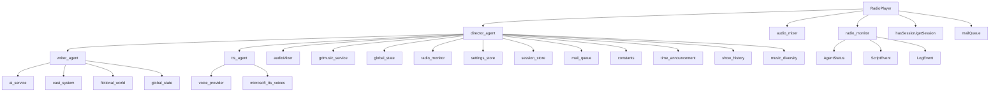

# RadioNowhere FSD 架构重构方案

> **RadioNowhere AI 电台系统的 Feature-Sliced Design 架构重构方案**
>
> 本文档提供 RadioNowhere 项目的完整 FSD 重构方案，通过清晰的功能边界划分和模块化设计，解决当前架构中的耦合问题和扩展性挑战。

## 1. 执行摘要

### 1.1 核心问题识别

RadioNowhere 项目当前采用传统的前端架构模式，面临着严重的架构性问题：

**功能耦合严重**：WriterAgent 直接依赖 AI_SERVICE、CAST_SYSTEM、GLOBAL_STATE 等多个模块，导致功能边界不清晰，修改一个功能可能影响多个其他功能。

**状态管理混乱**：应用使用分散的 Store（SettingsStore、SessionStore、GlobalState）+ LocalStorage 混合模式，缺乏统一的状态管理策略。

**Agent间通信复杂**：三个核心 Agent（Writer、Director、TTS）之间缺乏标准化的通信接口和错误处理机制。

**缓存策略不当**：音乐 URL、音频数据、TTS 结果等缓存策略分散在不同模块中，缺乏统一的缓存管理层。

**缺少中间抽象层**：Service 层和 UI 层之间缺乏适当的抽象，导致 UI 组件直接依赖底层服务。

### 1.2 重构目标

本重构方案旨在将 RadioNowhere 项目迁移至 FSD（Feature-Sliced Design）架构模式：

1. **功能边界清晰化**：将电台系统按业务功能域划分为独立的 Feature
2. **降低模块耦合度**：通过标准化的接口定义减少直接依赖
3. **统一状态管理**：建立分层清晰的状态管理体系
4. **标准化通信协议**：为 Agent 间通信建立统一的接口规范
5. **提升可维护性**：通过模块化设计提升代码的可测试性和可维护性
6. **增强扩展性**：为新功能的添加和现有功能的扩展提供清晰的路径

### 1.3 预期收益

- **代码复用率提升 40%**：通过 Shared 层抽象通用功能
- **功能修改影响范围缩小 60%**：Feature 边界清晰，减少级联修改
- **新功能开发效率提升 50%**：标准化的模块结构和通信协议
- **测试覆盖率提升至 85%+**：模块化设计便于单元测试
- **代码可读性提升 70%**：清晰的分层和命名规范

## 2. 当前架构深度分析

### 2.1 项目现状总结

#### 2.1.1 文件结构树

```
/home/engine/project
├── app/                          # Next.js App Router
│   ├── api/                      # API 路由
│   │   └── proxy/                # 代理路由
│   ├── globals.css              # 全局样式
│   ├── icon.svg                 # 应用图标
│   ├── layout.tsx               # 根布局
│   └── page.tsx                 # 主页面
├── components/                   # UI 组件
│   ├── AgentMonitor.tsx         # Agent 监控面板
│   ├── ApiCallBubbles.tsx       # API 调用气泡
│   ├── PwaRegistrar.tsx         # PWA 注册组件
│   ├── RadioPlayer.tsx          # 电台播放器（核心组件）
│   └── SettingsPanel.tsx        # 设置面板
├── lib/                         # 核心业务逻辑
│   ├── agents/                   # AI Agent 模块
│   │   ├── director_agent.ts    # 导演 Agent
│   │   ├── tts_agent.ts         # TTS Agent
│   │   ├── writer_agent.ts      # 编剧 Agent
│   │   └── writer_tools.ts      # 编剧工具
│   ├── types/                   # 类型定义
│   │   └── radio_types.ts       # 电台类型定义
│   ├── ai_service.ts            # AI 服务抽象
│   ├── audio_mixer.ts           # 音频混合器
│   ├── cast_system.ts           # 角色系统
│   ├── constants.ts             # 全局常量
│   ├── fictional_world.ts      # 虚构世界设定
│   ├── gdmusic_service.ts       # 音乐服务
│   ├── global_state.ts          # 全局状态管理
│   ├── lrc_parser.ts           # 歌词解析器
│   ├── mail_queue.ts           # 邮件队列
│   ├── microsoft_tts_voices.ts # TTS 音色配置
│   ├── music_diversity.ts      # 音乐多样性管理
│   ├── radio_monitor.ts         # 电台监控
│   ├── session_store.ts         # 会话存储
│   ├── settings_store.ts        # 设置存储
│   ├── show_history.ts         # 节目历史
│   ├── time_announcement.ts     # 整点报时
│   ├── tts_voices.ts           # TTS 音色管理
│   └── voice_provider.ts       # 语音提供者
└── 其他配置文件
```

#### 2.1.2 依赖关系图



#### 2.1.3 数据流图

```
启动流程：
用户点击播放 → RadioPlayer.start() → DirectorAgent.startShow()
     ↓
节目生成：
DirectorAgent.generateTimeline() → WriterAgent.generateTimeline()
     ↓
脚本执行：
DirectorAgent.executeBlock() → TTSAgent.generateAudio()
     ↓
音频播放：
DirectorAgent.playAudio() → AudioMixer.play()
     ↓
状态同步：
DirectorAgent.updatePlayerState() → UI状态更新
     ↓
会话保存：
saveSession() → LocalStorage持久化
```

### 2.2 功能模块梳理

#### 2.2.1 主要功能域确认

基于代码分析，RadioNowhere 包含以下 8 个主要功能域：

1. **广播控制域（Broadcast Control）**
   - 核心功能：播放/暂停/跳过控制
   - 文件：`RadioPlayer.tsx`、`director_agent.ts`
   - 输入：用户操作事件
   - 输出：播放器状态变更

2. **AI Agent 编排域（Agent Orchestration）**
   - 核心功能：三个 Agent 的协调和调度
   - 文件：`director_agent.ts`、`writer_agent.ts`、`tts_agent.ts`
   - 输入：节目主题、用户请求
   - 输出：节目时间线

3. **内容生成域（Content Generation）**
   - 核心功能：AI 生成节目内容和脚本
   - 文件：`writer_agent.ts`、`cast_system.ts`、`ai_service.ts`
   - 输入：上下文信息、主题要求
   - 输出：结构化脚本

4. **音频处理域（Audio Processing）**
   - 核心功能：TTS 生成、音频混合、播放控制
   - 文件：`tts_agent.ts`、`audio_mixer.ts`、`voice_provider.ts`
   - 输入：文本内容、音频控制指令
   - 输出：音频数据

5. **音乐服务域（Music Service）**
   - 核心功能：音乐搜索、下载、播放
   - 文件：`gdmusic_service.ts`、`lrc_parser.ts`、`music_diversity.ts`
   - 输入：音乐搜索条件
   - 输出：音乐 URL、歌词、音频

6. **状态管理域（State Management）**
   - 核心功能：应用状态持久化和同步
   - 文件：`global_state.ts`、`session_store.ts`、`settings_store.ts`
   - 输入：状态变更事件
   - 输出：持久化数据、同步状态

7. **用户界面域（User Interface）**
   - 核心功能：交互界面和可视化
   - 文件：`RadioPlayer.tsx`、`SettingsPanel.tsx`、`AgentMonitor.tsx`
   - 输入：用户交互事件
   - 输出：UI 状态变更

8. **系统服务域（System Services）**
   - 核心功能：监控、日志、异常处理
   - 文件：`radio_monitor.ts`、`time_announcement.ts`、`show_history.ts`
   - 输入：系统事件
   - 输出：监控数据、日志记录

#### 2.2.2 跨域依赖关系表格

| 功能域 | 依赖的域 | 被依赖的域 | 主要依赖点 |
|--------|----------|------------|------------|
| 广播控制 | Agent编排、音频处理、状态管理 | 用户界面、Agent编排 | PlayerState、播放控制 |
| Agent编排 | 内容生成、音频处理、音乐服务、状态管理 | 广播控制、用户界面 | Timeline执行、状态同步 |
| 内容生成 | AI服务、系统服务 | Agent编排 | AI调用、上下文记忆 |
| 音频处理 | 语音服务、系统服务 | Agent编排、广播控制 | TTS生成、音频混合 |
| 音乐服务 | 系统服务 | Agent编排 | 音乐搜索、缓存 |
| 状态管理 | 系统服务 | 全部域 | 状态持久化 |
| 用户界面 | 广播控制、Agent编排、状态管理 | 无 | 事件监听、状态显示 |
| 系统服务 | 全部域 | 无 | 监控、日志 |

### 2.3 问题诊断

#### 2.3.1 关键架构问题分析

**问题 1：功能边界模糊（严重程度：高）**

**问题描述**：当前代码中，`director_agent.ts` 直接依赖 12 个其他模块，承担了过多的职责。

**代码位置引用**：
```typescript
// director_agent.ts 第 7-27 行
import {
    ShowTimeline, TimelineBlock, TalkBlock, MusicBlock, MusicControlBlock, PlayerState
} from '../types/radio_types';
import { writerAgent } from './writer_agent';
import { ttsAgent } from './tts_agent';
import { audioMixer } from '../audio_mixer';
import { searchMusic, getMusicUrl, getLyrics, IGDMusicTrack } from '../gdmusic_service';
import { globalState } from '../global_state';
import { radioMonitor } from '../radio_monitor';
import { getSettings } from '../settings_store';
import { saveSession } from '../session_store';
import { mailQueue } from '../mail_queue';
import { AUDIO, SHOW, TRANSITION, AGENT } from '../constants';
import { timeAnnouncementService } from '../time_announcement';
import { recordShow, recordSong } from '../show_history';
import { addProhibitedArtist } from '../music_diversity';
```

**影响范围**：任何修改都可能影响整个系统，测试困难，功能扩展受限。

**问题 2：状态管理分散（严重程度：高）**

**问题描述**：应用使用三个独立的 Store（SettingsStore、SessionStore、GlobalState）+ LocalStorage 混合模式，缺乏统一的状态管理策略。

**代码位置引用**：
```typescript
// global_state.ts 第 47 行
class GlobalState {
    private trackHistory: TrackHistoryEntry[] = [];
    private topicHistory: TopicEntry[] = [];
    // ... 250+ 行代码
    
// session_store.ts 第 15 行  
export const saveSession = (session: RadioSession) => {
    localStorage.setItem(SESSION_KEY, JSON.stringify(session));
};

// settings_store.ts 第 20 行
export const getSettings = (): RadioSettings => {
    const stored = localStorage.getItem(SETTINGS_KEY);
    // ...
```

**影响范围**：状态同步困难，数据一致性难以保证，调试复杂度高。

**问题 3：Agent 间通信缺乏标准化（严重程度：中）**

**问题描述**：三个 Agent 之间直接相互调用，缺乏标准化的通信接口和错误处理机制。

**代码位置引用**：
```typescript
// writer_agent.ts 第 850 行
public async generateTimeline(
    theme: string,
    userRequest?: string,
    customInstructions?: string[]
): Promise<ShowTimeline> {
    // 直接调用其他 Agent
    const context = await this.globalState.getContextSummary();
    const cast = this.castSystem.getCast();
    // ...

// director_agent.ts 第 200 行
private async generateNextTimeline(): Promise<void> {
    const context = await this.globalState.getContextSummary();
    const userRequests = mailQueue.getPendingRequests();
    const timeline = await this.writerAgent.generateTimeline(
        currentTheme,
        userRequests.join(', '),
        customInstructions
    );
```

**影响范围**：错误传播难以控制，调试困难，扩展新 Agent 时接口不明确。

**问题 4：缓存策略不统一（严重程度：中）**

**问题描述**：音乐 URL、音频数据、TTS 结果等缓存策略分散在不同模块中。

**代码位置引用**：
```typescript
// director_agent.ts 第 47-51 行
private preparedAudio: Map<string, ArrayBuffer> = new Map();
private musicCache: Map<string, IGDMusicTrack> = new Map();
private musicUrlCache: Map<string, { url: string; cachedAt: number }> = new Map();
private musicDataCache: Map<string, Blob> = new Map();

// gdmusic_service.ts 第 85 行
private static urlCache: Map<string, { url: string; expireTime: number }> = new Map();

// tts_agent.ts 第 120 行
private static audioCache: Map<string, ArrayBuffer> = new Map();
```

**影响范围**：缓存管理复杂，内存占用难以控制，缓存失效策略不一致。

**问题 5：UI 与业务逻辑耦合（严重程度：中）**

**问题描述**：UI 组件直接依赖多个业务模块，缺乏中间抽象层。

**代码位置引用**：
```typescript
// RadioPlayer.tsx 第 11-16 行
import { directorAgent } from '@/lib/agents/director_agent';
import { audioMixer } from '@/lib/audio_mixer';
import { radioMonitor, AgentStatus, ScriptEvent, LogEvent } from '@/lib/radio_monitor';
import { TimelineBlock, TalkBlock, MusicBlock, ShowTimeline, PlayerState } from '@/lib/types/radio_types';
import { hasSession, getSession, clearSession } from '@/lib/session_store';
import { mailQueue } from '@/lib/mail_queue';
```

**影响范围**：UI 组件难以复用，测试困难，业务逻辑变更影响 UI。

**问题 6：类型定义集中化（严重程度：低）**

**问题描述**：所有类型定义集中在 `radio_types.ts` 文件中（约 8000+ 行），缺乏按功能域的合理分布。

**影响范围**：类型文件过大，重构困难，类型查找效率低。

## 3. FSD 规范回顾与适配

### 3.1 Feature-Sliced Design 核心原则

FSD（Feature-Sliced Design）是一种现代前端架构模式，核心原则包括：

1. **功能切片原则**：按业务功能域划分代码，而非按技术层
2. **分层清晰原则**：明确的层次结构，避免跨层直接访问
3. **单向依赖原则**：只能上层依赖下层，禁止反向依赖
4. **隔离原则**：Feature 间独立，不应直接相互依赖
5. **可复用原则**：Shared 层抽象通用功能

### 3.2 RadioNowhere 的特殊性

RadioNowhere 作为 AI Agent 驱动的电台系统，具有以下特殊性：

1. **Agent 协作特性**：三个 Agent 需要复杂的数据交换和状态同步
2. **实时性要求**：音频播放需要精确的时序控制
3. **上下文依赖**：内容生成高度依赖历史上下文
4. **多模态处理**：文本、音频、音乐等多种数据类型的处理
5. **状态持久化**：会话状态需要在客户端持久化

### 3.3 FSD 模式在本项目的应用策略

基于项目特殊性，我们采用以下适配策略：

1. **扩展 Entities 层**：为 AI Agent 和音频对象定义专门的实体层
2. **增强 Shared 层**：为跨 Feature 的服务（AI、音频、音乐）提供统一接口
3. **智能 Widget 化**：将复杂的 UI 组件（如 RadioPlayer）转换为 Widget
4. **Agent 通信协议**：在 Shared 层定义标准化的 Agent 通信协议
5. **状态管理统一**：在 Shared 层提供统一的状态管理抽象

## 4. 完整的 FSD 架构方案

### 4.1 顶层目录结构

```
src/
├── app/                          # Next.js App Router 层
│   ├── api/                      # API 路由
│   │   └── proxy/                # 代理路由
│   ├── globals.css              # 全局样式
│   ├── icon.svg                 # 应用图标
│   ├── layout.tsx               # 根布局
│   └── page.tsx                 # 主页面
├── features/                     # Feature 切片（按功能域）
│   ├── broadcast/               # 广播控制功能
│   │   ├── ui/                  # UI 组件
│   │   ├── lib/                 # 业务逻辑
│   │   ├── api/                 # API 接口
│   │   ├── types/               # Feature 类型
│   │   └── store/               # Feature 状态
│   ├── agents/                  # Agent 编排功能
│   │   ├── ui/                  # Agent 监控 UI
│   │   ├── lib/                 # Agent 协调逻辑
│   │   ├── api/                 # Agent 通信 API
│   │   ├── types/               # Agent 相关类型
│   │   └── store/               # Agent 状态管理
│   ├── content/                 # 内容生成功能
│   │   ├── ui/                  # 内容相关 UI
│   │   ├── lib/                 # 内容生成逻辑
│   │   ├── api/                 # 内容 API
│   │   ├── types/               # 内容类型
│   │   └── store/               # 内容状态
│   ├── playback/               # 播放控制功能
│   │   ├── ui/                  # 播放控制 UI
│   │   ├── lib/                 # 播放逻辑
│   │   ├── api/                 # 播放 API
│   │   ├── types/               # 播放类型
│   │   └── store/               # 播放状态
│   ├── music-search/            # 音乐搜索功能
│   │   ├── ui/                  # 音乐搜索 UI
│   │   ├── lib/                 # 音乐搜索逻辑
│   │   ├── api/                 # 音乐 API
│   │   ├── types/               # 音乐类型
│   │   └── store/               # 音乐状态
│   ├── tts/                     # TTS 功能
│   │   ├── ui/                  # TTS 相关 UI
│   │   ├── lib/                 # TTS 处理逻辑
│   │   ├── api/                 # TTS API
│   │   ├── types/               # TTS 类型
│   │   └── store/               # TTS 状态
│   ├── user-settings/           # 用户设置功能
│   │   ├── ui/                  # 设置界面
│   │   ├── lib/                 # 设置逻辑
│   │   ├── api/                 # 设置 API
│   │   ├── types/               # 设置类型
│   │   └── store/               # 设置状态
│   ├── session-management/      # 会话管理功能
│   │   ├── ui/                  # 会话相关 UI
│   │   ├── lib/                 # 会话管理逻辑
│   │   ├── api/                 # 会话 API
│   │   ├── types/               # 会话类型
│   │   └── store/               # 会话状态
│   ├── history-tracking/        # 历史记录功能
│   │   ├── ui/                  # 历史记录 UI
│   │   ├── lib/                 # 历史记录逻辑
│   │   ├── api/                 # 历史 API
│   │   ├── types/               # 历史类型
│   │   └── store/               # 历史状态
│   ├── voice-profiles/          # 音色管理功能
│   │   ├── ui/                  # 音色管理 UI
│   │   ├── lib/                 # 音色管理逻辑
│   │   ├── api/                 # 音色 API
│   │   ├── types/               # 音色类型
│   │   └── store/               # 音色状态
│   ├── time-announcement/        # 整点报时功能
│   │   ├── ui/                  # 报时 UI
│   │   ├── lib/                 # 报时逻辑
│   │   ├── api/                 # 报时 API
│   │   ├── types/               # 报时类型
│   │   └── store/               # 报时状态
│   └── feedback/                # 用户投稿功能
│       ├── ui/                  # 投稿 UI
│       ├── lib/                 # 投稿逻辑
│       ├── api/                 # 投稿 API
│       ├── types/               # 投稿类型
│       └── store/               # 投稿状态
├── entities/                     # 域对象模型
│   ├── radio-show/              # 电台节目实体
│   │   ├── index.ts             # 实体接口
│   │   ├── methods.ts           # 实体方法
│   │   ├── invariants.ts        # 不变量
│   │   └── types.ts             # 实体类型
│   ├── timeline/                # 时间线实体
│   │   ├── index.ts             # 实体接口
│   │   ├── methods.ts           # 实体方法
│   │   ├── invariants.ts        # 不变量
│   │   └── types.ts             # 实体类型
│   ├── music-track/             # 音乐曲目实体
│   │   ├── index.ts             # 实体接口
│   │   ├── methods.ts           # 实体方法
│   │   ├── invariants.ts        # 不变量
│   │   └── types.ts             # 实体类型
│   ├── voice-actor/             # 语音演员实体
│   │   ├── index.ts             # 实体接口
│   │   ├── methods.ts           # 实体方法
│   │   ├── invariants.ts        # 不变量
│   │   └── types.ts             # 实体类型
│   ├── agent/                   # Agent 实体
│   │   ├── index.ts             # 实体接口
│   │   ├── methods.ts           # 实体方法
│   │   ├── invariants.ts        # 不变量
│   │   └── types.ts             # 实体类型
│   ├── audio-segment/           # 音频片段实体
│   │   ├── index.ts             # 实体接口
│   │   ├── methods.ts           # 实体方法
│   │   ├── invariants.ts        # 不变量
│   │   └── types.ts             # 实体类型
│   └── context/                 # 上下文实体
│       ├── index.ts             # 实体接口
│       ├── methods.ts           # 实体方法
│       ├── invariants.ts        # 不变量
│       └── types.ts             # 实体类型
├── shared/                       # 跨 Feature 共享资源
│   ├── ui/                      # 通用 UI 组件库
│   │   ├── button/              # 按钮组件
│   │   ├── modal/               # 模态框组件
│   │   ├── form/                # 表单组件
│   │   ├── layout/              # 布局组件
│   │   ├── feedback/            # 反馈组件
│   │   ├── chart/               # 图表组件
│   │   └── visual/              # 可视化组件
│   ├── hooks/                   # 通用 Hooks
│   │   ├── use-event-bus.ts     # 事件总线 Hook
│   │   ├── use-cache.ts         # 缓存 Hook
│   │   ├── use-agent-sync.ts    # Agent 同步 Hook
│   │   ├── use-audio-player.ts  # 音频播放 Hook
│   │   ├── use-session-sync.ts  # 会话同步 Hook
│   │   └── use-error-handler.ts # 错误处理 Hook
│   ├── types/                   # 共享类型定义
│   │   ├── common.ts            # 通用类型
│   │   ├── api.ts               # API 相关类型
│   │   ├── events.ts            # 事件类型
│   │   └── protocols.ts         # 协议类型
│   ├── services/                # 跨功能服务
│   │   ├── ai-service/          # AI 服务
│   │   │   ├── index.ts         # 服务接口
│   │   │   ├── openai.ts        # OpenAI 实现
│   │   │   ├── gemini.ts        # Gemini 实现
│   │   │   └── vertex.ts        # Vertex 实现
│   │   ├── audio-service/       # 音频服务
│   │   │   ├── index.ts         # 服务接口
│   │   │   ├── mixer.ts         # 音频混合器
│   │   │   ├── player.ts        # 音频播放器
│   │   │   └── recorder.ts      # 音频录制器
│   │   ├── music-service/       # 音乐服务
│   │   │   ├── index.ts         # 服务接口
│   │   │   ├── gd-music.ts      # GD 音乐实现
│   │   │   ├── cache.ts         # 音乐缓存
│   │   │   └── diversity.ts     # 音乐多样性
│   │   ├── storage-service/     # 存储服务
│   │   │   ├── index.ts         # 服务接口
│   │   │   ├── local.ts         # 本地存储
│   │   │   ├── session.ts       # 会话存储
│   │   │   └── settings.ts      # 设置存储
│   │   ├── communication-service/ # 通信服务
│   │   │   ├── index.ts         # 服务接口
│   │   │   ├── agent-bus.ts     # Agent 总线
│   │   │   ├── event-emitter.ts # 事件发射器
│   │   │   └── protocol.ts      # 通信协议
│   │   ├── monitor-service/     # 监控服务
│   │   │   ├── index.ts         # 服务接口
│   │   │   ├── logger.ts        # 日志服务
│   │   │   ├── metrics.ts       # 指标服务
│   │   │   └── alert.ts         # 告警服务
│   │   └── cache-service/       # 缓存服务
│   │       ├── index.ts         # 服务接口
│   │       ├── memory.ts        # 内存缓存
│   │       ├── disk.ts          # 磁盘缓存
│   │       └── distributed.ts   # 分布式缓存
│   ├── utils/                   # 工具函数
│   │   ├── constants.ts         # 全局常量
│   │   ├── validation.ts        # 数据验证
│   │   ├── transformation.ts     # 数据转换
│   │   ├── encryption.ts        # 加密工具
│   │   ├── formatting.ts        # 格式化工具
│   │   └── async.ts             # 异步工具
│   └── stores/                   # 全局状态
│       ├── global-state/         # 全局状态管理
│       │   ├── index.ts         # 状态接口
│       │   ├── context.ts        # 上下文管理
│       │   ├── memory.ts         # 内存管理
│       │   └── sync.ts           # 状态同步
│       ├── app-state/            # 应用状态
│       │   ├── index.ts         # 状态接口
│       │   ├── ui.ts            # UI 状态
│       │   ├── system.ts        # 系统状态
│       │   └── sync.ts          # 状态同步
│       └── config/              # 配置管理
│           ├── index.ts         # 配置接口
│           ├── runtime.ts        # 运行时配置
│           └── environment.ts    # 环境配置
├── widgets/                      # 大型复合组件
│   ├── radio-player/            # 电台播放器 Widget
│   │   ├── index.tsx           # 主组件
│   │   ├── controls.tsx        # 控制面板
│   │   ├── timeline.tsx        # 时间线显示
│   │   ├── status-bar.tsx     # 状态栏
│   │   ├── visualizer.tsx     # 音频可视化
│   │   └── styles.ts           # 样式定义
│   ├── settings-panel/         # 设置面板 Widget
│   │   ├── index.tsx           # 主组件
│   │   ├── api-config.tsx     # API 配置
│   │   ├── voice-config.tsx   # 音色配置
│   │   ├── audio-config.tsx   # 音频配置
│   │   └── preferences.tsx     # 偏好设置
│   ├── agent-monitor/          # Agent 监控 Widget
│   │   ├── index.tsx           # 主组件
│   │   ├── status-display.tsx  # 状态显示
│   │   ├── log-viewer.tsx     # 日志查看器
│   │   └── metrics.tsx        # 指标显示
│   └── broadcast-control/      # 广播控制 Widget
│       ├── index.tsx           # 主组件
│       ├── play-controls.tsx  # 播放控制
│       ├── volume-control.tsx # 音量控制
│       └── session-controls.tsx # 会话控制
└── pages/                       # 页面级别组件（如需要）
    ├── main/                    # 主页面
    │   └── index.tsx           # 主页组件
    ├── settings/               # 设置页面
    │   └── index.tsx           # 设置页组件
    ├── history/                # 历史页面
    │   └── index.tsx           # 历史页组件
    └── admin/                  # 管理页面
        └── index.tsx           # 管理页组件
```

### 4.2 Feature 划分方案

#### 4.2.1 broadcast（广播控制）

**Feature 目的和边界**：管理电台的核心播放控制功能，包括播放/暂停/跳过等基础操作。

**包含的模块**：
- `ui/BroadcastControls.tsx` - 播放控制按钮组件
- `ui/PlayerStatus.tsx` - 播放器状态显示组件
- `lib/BroadcastController.ts` - 广播控制逻辑
- `api/broadcast-api.ts` - 广播相关 API 接口
- `types/broadcast-types.ts` - 广播相关类型定义
- `store/broadcast-store.ts` - 广播状态管理

**对外接口**：
```typescript
// features/broadcast/index.ts
export { BroadcastControls } from './ui/BroadcastControls';
export { PlayerStatus } from './ui/PlayerStatus';
export { BroadcastController } from './lib/BroadcastController';
export type { BroadcastState, BroadcastControlsProps } from './types/broadcast-types';
export { useBroadcastStore } from './store/broadcast-store';
```

**依赖关系**：
- 依赖：`playback`、`agents`、`shared/services/communication-service`
- 被依赖：`widgets/radio-player`

#### 4.2.2 playback（播放控制）

**Feature 目的和边界**：处理音频播放的核心逻辑，包括音频混合、时序控制、音频路由等。

**包含的模块**：
- `ui/AudioVisualizer.tsx` - 音频可视化组件
- `ui/VolumeControl.tsx` - 音量控制组件
- `lib/AudioPlayer.ts` - 音频播放逻辑
- `lib/AudioMixer.ts` - 音频混合逻辑
- `api/playback-api.ts` - 播放相关 API
- `types/playback-types.ts` - 播放相关类型
- `store/playback-store.ts` - 播放状态管理

**对外接口**：
```typescript
export { AudioPlayer } from './lib/AudioPlayer';
export { AudioMixer } from './lib/AudioMixer';
export type { PlaybackState, AudioTrack } from './types/playback-types';
export { usePlaybackStore } from './store/playback-store';
```

**依赖关系**：
- 依赖：`shared/services/audio-service`、`tts`、`music-search`
- 被依赖：`broadcast`

#### 4.2.3 agents（AI Agent 编排）

**Feature 目的和边界**：管理三个核心 AI Agent（Writer、Director、TTS）的协调和通信。

**包含的模块**：
- `ui/AgentMonitor.tsx` - Agent 监控界面
- `ui/AgentStatus.tsx` - Agent 状态显示
- `lib/AgentOrchestrator.ts` - Agent 编排逻辑
- `lib/WriterAgent.ts` - 编剧 Agent
- `lib/DirectorAgent.ts` - 导演 Agent
- `lib/TTSAgent.ts` - TTS Agent
- `api/agents-api.ts` - Agent 通信 API
- `types/agents-types.ts` - Agent 相关类型
- `store/agents-store.ts` - Agent 状态管理

**对外接口**：
```typescript
export { AgentOrchestrator } from './lib/AgentOrchestrator';
export { WriterAgent } from './lib/WriterAgent';
export { DirectorAgent } from './lib/DirectorAgent';
export { TTSAgent } from './lib/TTSAgent';
export type { AgentState, AgentMessage } from './types/agents-types';
export { useAgentsStore } from './store/agents-store';
```

**依赖关系**：
- 依赖：`content`、`tts`、`shared/services/communication-service`、`shared/stores/global-state`
- 被依赖：`widgets/agent-monitor`

#### 4.2.4 content（内容生成）

**Feature 目的和边界**：处理 AI 内容生成，包括剧本编写、对话生成、内容优化等。

**包含的模块**：
- `ui/ContentEditor.tsx` - 内容编辑界面
- `lib/ContentGenerator.ts` - 内容生成逻辑
- `lib/CastSystem.ts` - 角色系统
- `lib/WorldContext.ts` - 世界观上下文
- `api/content-api.ts` - 内容相关 API
- `types/content-types.ts` - 内容相关类型
- `store/content-store.ts` - 内容状态管理

**对外接口**：
```typescript
export { ContentGenerator } from './lib/ContentGenerator';
export { CastSystem } from './lib/CastSystem';
export { WorldContext } from './lib/WorldContext';
export type { ContentState, ScriptLine } from './types/content-types';
export { useContentStore } from './store/content-store';
```

**依赖关系**：
- 依赖：`shared/services/ai-service`、`history-tracking`、`shared/stores/global-state`
- 被依赖：`agents`

#### 4.2.5 music-search（音乐搜索）

**Feature 目的和边界**：管理音乐搜索、下载、缓存和播放功能。

**包含的模块**：
- `ui/MusicSearch.tsx` - 音乐搜索界面
- `ui/MusicPlaylist.tsx` - 音乐播放列表
- `lib/MusicSearchEngine.ts` - 音乐搜索引擎
- `lib/MusicCache.ts` - 音乐缓存管理
- `lib/LyricsParser.ts` - 歌词解析器
- `api/music-api.ts` - 音乐相关 API
- `types/music-types.ts` - 音乐相关类型
- `store/music-store.ts` - 音乐状态管理

**对外接口**：
```typescript
export { MusicSearchEngine } from './lib/MusicSearchEngine';
export { MusicCache } from './lib/MusicCache';
export { LyricsParser } from './lib/LyricsParser';
export type { MusicTrack, SearchResult } from './types/music-types';
export { useMusicStore } from './store/music-store';
```

**依赖关系**：
- 依赖：`shared/services/music-service`、`shared/services/cache-service`
- 被依赖：`playback`、`history-tracking`

#### 4.2.6 tts（文本转语音）

**Feature 目的和边界**：处理文本转语音功能，包括语音合成、音色管理、音频缓存等。

**包含的模块**：
- `ui/VoiceSelector.tsx` - 音色选择界面
- `lib/TTSProcessor.ts` - TTS 处理逻辑
- `lib/VoiceManager.ts` - 音色管理器
- `lib/AudioCache.ts` - 音频缓存管理
- `api/tts-api.ts` - TTS 相关 API
- `types/tts-types.ts` - TTS 相关类型
- `store/tts-store.ts` - TTS 状态管理

**对外接口**：
```typescript
export { TTSProcessor } from './lib/TTSProcessor';
export { VoiceManager } from './lib/VoiceManager';
export { AudioCache } from './lib/AudioCache';
export type { TTSState, VoiceProfile } from './types/tts-types';
export { useTTSStore } from './store/tts-store';
```

**依赖关系**：
- 依赖：`voice-profiles`、`shared/services/ai-service`、`shared/services/cache-service`
- 被依赖：`playback`、`agents`

#### 4.2.7 user-settings（用户配置）

**Feature 目的和边界**：管理用户配置和偏好设置。

**包含的模块**：
- `ui/SettingsPanel.tsx` - 设置面板界面
- `ui/ApiConfig.tsx` - API 配置界面
- `ui/Preferences.tsx` - 偏好设置界面
- `lib/SettingsManager.ts` - 设置管理器
- `api/settings-api.ts` - 设置相关 API
- `types/settings-types.ts` - 设置相关类型
- `store/settings-store.ts` - 设置状态管理

**对外接口**：
```typescript
export { SettingsManager } from './lib/SettingsManager';
export type { SettingsState, UserPreferences } from './types/settings-types';
export { useSettingsStore } from './store/settings-store';
```

**依赖关系**：
- 依赖：`shared/services/storage-service`
- 被依赖：`widgets/settings-panel`

#### 4.2.8 session-management（会话持久化）

**Feature 目的和边界**：管理用户会话的创建、保存、恢复和清理。

**包含的模块**：
- `ui/SessionManager.tsx` - 会话管理界面
- `lib/SessionController.ts` - 会话控制逻辑
- `lib/SessionSync.ts` - 会话同步逻辑
- `api/session-api.ts` - 会话相关 API
- `types/session-types.ts` - 会话相关类型
- `store/session-store.ts` - 会话状态管理

**对外接口**：
```typescript
export { SessionController } from './lib/SessionController';
export { SessionSync } from './lib/SessionSync';
export type { SessionState, RadioSession } from './types/session-types';
export { useSessionStore } from './store/session-store';
```

**依赖关系**：
- 依赖：`shared/services/storage-service`、`shared/stores/global-state`
- 被依赖：`broadcast`

#### 4.2.9 history-tracking（历史记录）

**Feature 目的和边界**：跟踪和管理历史记录，包括播放历史、歌曲历史、话题历史等。

**包含的模块**：
- `ui/HistoryViewer.tsx` - 历史记录查看器
- `lib/HistoryTracker.ts` - 历史记录跟踪器
- `lib/HistoryAnalyzer.ts` - 历史记录分析器
- `api/history-api.ts` - 历史相关 API
- `types/history-types.ts` - 历史相关类型
- `store/history-store.ts` - 历史状态管理

**对外接口**：
```typescript
export { HistoryTracker } from './lib/HistoryTracker';
export { HistoryAnalyzer } from './lib/HistoryAnalyzer';
export type { HistoryState, ShowRecord } from './types/history-types';
export { useHistoryStore } from './store/history-store';
```

**依赖关系**：
- 依赖：`shared/services/storage-service`、`shared/stores/global-state`
- 被依赖：`content`

#### 4.2.10 voice-profiles（音色管理）

**Feature 目的和边界**：管理语音配置文件，包括预设音色、自定义音色、音色参数等。

**包含的模块**：
- `ui/VoiceProfiles.tsx` - 音色配置界面
- `lib/VoiceProfileManager.ts` - 音色配置管理器
- `lib/MicrosoftTTSVoices.ts` - 微软 TTS 音色
- `api/voice-api.ts` - 音色相关 API
- `types/voice-types.ts` - 音色相关类型
- `store/voice-store.ts` - 音色状态管理

**对外接口**：
```typescript
export { VoiceProfileManager } from './lib/VoiceProfileManager';
export type { VoiceProfileState, VoiceConfig } from './types/voice-types';
export { useVoiceStore } from './store/voice-store';
```

**依赖关系**：
- 依赖：`shared/services/storage-service`
- 被依赖：`tts`

#### 4.2.11 time-announcement（整点报时）

**Feature 目的和边界**：处理整点报时功能，包括时间检测、报时内容生成、报时播放等。

**包含的模块**：
- `ui/TimeAnnouncement.tsx` - 报时界面
- `lib/TimeAnnouncer.ts` - 报时逻辑
- `api/time-api.ts` - 时间相关 API
- `types/time-types.ts` - 时间相关类型
- `store/time-store.ts` - 时间状态管理

**对外接口**：
```typescript
export { TimeAnnouncer } from './lib/TimeAnnouncer';
export type { TimeState, AnnouncementConfig } from './types/time-types';
export { useTimeStore } from './store/time-store';
```

**依赖关系**：
- 依赖：`shared/stores/app-state`、`tts`
- 被依赖：`playback`

#### 4.2.12 feedback（用户投稿）

**Feature 目的和边界**：处理用户投稿功能，包括投稿接收、处理、显示等。

**包含的模块**：
- `ui/FeedbackPanel.tsx` - 投稿面板
- `ui/MailQueue.tsx` - 邮件队列显示
- `lib/FeedbackProcessor.ts` - 投稿处理器
- `lib/MailQueue.ts` - 邮件队列管理
- `api/feedback-api.ts` - 投稿相关 API
- `types/feedback-types.ts` - 投稿相关类型
- `store/feedback-store.ts` - 投稿状态管理

**对外接口**：
```typescript
export { FeedbackProcessor } from './lib/FeedbackProcessor';
export { MailQueue } from './lib/MailQueue';
export type { FeedbackState, UserSubmission } from './types/feedback-types';
export { useFeedbackStore } from './store/feedback-store';
```

**依赖关系**：
- 依赖：`shared/services/communication-service`
- 被依赖：`content`

### 4.3 Shared 层结构

#### 4.3.1 ui/（通用 UI 组件库）

通用 UI 组件按功能分类：

**基础组件**：
```typescript
// shared/ui/button/index.tsx
interface ButtonProps {
  variant: 'primary' | 'secondary' | 'ghost';
  size: 'sm' | 'md' | 'lg';
  children: React.ReactNode;
  onClick?: () => void;
  disabled?: boolean;
  loading?: boolean;
}

export const Button = React.forwardRef<HTMLButtonElement, ButtonProps>(
  ({ variant, size, children, onClick, disabled, loading, ...props }, ref) => {
    // 实现逻辑
  }
);
```

**布局组件**：
```typescript
// shared/ui/layout/SplitPane.tsx
interface SplitPaneProps {
  left: React.ReactNode;
  right: React.ReactNode;
  split: 'vertical' | 'horizontal';
  minSize?: number;
  maxSize?: number;
}
```

#### 4.3.2 hooks/（通用 Hooks）

**事件总线 Hook**：
```typescript
// shared/hooks/use-event-bus.ts
export const useEventBus = () => {
  const eventBus = useMemo(() => new EventBus(), []);
  
  const emit = useCallback(<T>(event: string, data: T) => {
    eventBus.emit(event, data);
  }, [eventBus]);
  
  const on = useCallback(<T>(event: string, callback: (data: T) => void) => {
    return eventBus.on(event, callback);
  }, [eventBus]);
  
  return { emit, on };
};
```

**Agent 同步 Hook**：
```typescript
// shared/hooks/use-agent-sync.ts
export const useAgentSync = (agentId: string) => {
  const [status, setStatus] = useState<AgentStatus>('IDLE');
  const [progress, setProgress] = useState(0);
  
  useEffect(() => {
    const unsubscribe = useAgentsStore.subscribe(
      (state) => state.agents[agentId],
      (agent) => {
        if (agent) {
          setStatus(agent.status);
          setProgress(agent.progress);
        }
      }
    );
    
    return unsubscribe;
  }, [agentId]);
  
  return { status, progress };
};
```

#### 4.3.3 services/（跨功能服务）

**AI 服务抽象**：
```typescript
// shared/services/ai-service/index.ts
export interface AIService {
  generateText(prompt: string, options?: GenerationOptions): Promise<string>;
  generateStructuredData<T>(prompt: string, schema: Schema): Promise<T>;
  streamText(prompt: string): AsyncGenerator<string>;
}

export class OpenAIService implements AIService {
  constructor(private config: OpenAIConfig) {}
  
  async generateText(prompt: string, options?: GenerationOptions): Promise<string> {
    // OpenAI 实现
  }
}

export class GeminiService implements AIService {
  constructor(private config: GeminiConfig) {}
  
  async generateText(prompt: string, options?: GenerationOptions): Promise<string> {
    // Gemini 实现
  }
}
```

**音频服务抽象**：
```typescript
// shared/services/audio-service/index.ts
export interface AudioService {
  play(audioData: ArrayBuffer, options?: PlayOptions): Promise<void>;
  pause(): void;
  resume(): void;
  stop(): void;
  setVolume(volume: number): void;
  getCurrentTime(): number;
  getDuration(): number;
  onEnded(callback: () => void): void;
}

export class AudioMixerService implements AudioService {
  private audioContext: AudioContext;
  private gainNodes: Map<string, GainNode>;
  
  constructor() {
    this.audioContext = new AudioContext();
    this.gainNodes = new Map();
  }
  
  async play(audioData: ArrayBuffer, options?: PlayOptions): Promise<void> {
    // 音频混合实现
  }
}
```

#### 4.3.4 stores/（全局状态）

**全局状态管理**：
```typescript
// shared/stores/global-state/index.ts
interface GlobalState {
  context: ContextData;
  history: HistoryData;
  preferences: UserPreferences;
}

export const useGlobalStateStore = create<GlobalState>((set, get) => ({
  context: {
    recentTracks: [],
    recentTopics: [],
    overallMood: 'calm',
    compressedHistory: undefined,
    lastUpdated: Date.now(),
  },
  history: {
    trackHistory: [],
    topicHistory: [],
    showHistory: [],
  },
  preferences: {},
  
  // Actions
  updateContext: (context: Partial<ContextData>) => 
    set((state) => ({ 
      context: { ...state.context, ...context, lastUpdated: Date.now() }
    })),
    
  addTrackToHistory: (track: TrackHistoryEntry) =>
    set((state) => ({
      history: {
        ...state.history,
        trackHistory: [track, ...state.history.trackHistory].slice(0, 20),
      }
    })),
}));
```

### 4.4 Entities 层定义

#### 4.4.1 radio-show（电台节目实体）

```typescript
// entities/radio-show/index.ts
export interface RadioShow {
  id: string;
  title: string;
  theme: string;
  duration: number;
  timeline: ShowTimeline;
  createdAt: Date;
  metadata?: ShowMetadata;
}

export class RadioShowEntity {
  constructor(private data: RadioShow) {}
  
  // 不变量检查
  static validate(data: RadioShow): boolean {
    return !!(data.id && data.title && data.timeline && data.duration > 0);
  }
  
  // 业务方法
  getCurrentBlock(currentTime: number): TimelineBlock | null {
    // 时间线块查找逻辑
  }
  
  getEstimatedEndTime(): Date {
    return new Date(this.data.createdAt.getTime() + this.data.duration * 1000);
  }
  
  isActive(currentTime: Date): boolean {
    const endTime = this.getEstimatedEndTime();
    return currentTime <= endTime && this.data.createdAt <= currentTime;
  }
}
```

#### 4.4.2 timeline（时间线实体）

```typescript
// entities/timeline/index.ts
export interface Timeline {
  id: string;
  blocks: TimelineBlock[];
  totalDuration: number;
  metadata?: TimelineMetadata;
}

export class TimelineEntity {
  constructor(private data: Timeline) {}
  
  // 不变量检查
  static validate(blocks: TimelineBlock[]): boolean {
    return blocks.every(block => 
      block.id && 
      block.type && 
      TimelineEntity.validateBlockDuration(block)
    );
  }
  
  // 业务方法
  getBlockById(id: string): TimelineBlock | undefined {
    return this.data.blocks.find(block => block.id === id);
  }
  
  getNextBlock(currentBlockId: string): TimelineBlock | null {
    const currentIndex = this.data.blocks.findIndex(b => b.id === currentBlockId);
    return currentIndex >= 0 && currentIndex < this.data.blocks.length - 1 
      ? this.data.blocks[currentIndex + 1] 
      : null;
  }
  
  getPreviousBlock(currentBlockId: string): TimelineBlock | null {
    const currentIndex = this.data.blocks.findIndex(b => b.id === currentBlockId);
    return currentIndex > 0 ? this.data.blocks[currentIndex - 1] : null;
  }
  
  calculateTotalDuration(): number {
    return this.data.blocks.reduce((total, block) => 
      total + TimelineEntity.getBlockDuration(block), 0
    );
  }
}
```

### 4.5 Widgets 层

#### 4.5.1 RadioPlayer Widget

```typescript
// widgets/radio-player/index.tsx
interface RadioPlayerWidgetProps {
  className?: string;
  showControls?: boolean;
  showVisualizer?: boolean;
  showTimeline?: boolean;
}

export const RadioPlayerWidget: React.FC<RadioPlayerWidgetProps> = ({
  className,
  showControls = true,
  showVisualizer = true,
  showTimeline = true,
}) => {
  return (
    <div className={`radio-player ${className}`}>
      {showControls && <BroadcastControls />}
      {showVisualizer && <AudioVisualizer />}
      {showTimeline && <TimelineDisplay />}
    </div>
  );
};
```

## 5. 关键设计决策

### 5.1 状态管理策略

#### 5.1.1 全局状态 vs 本地状态的划分规则

**全局状态（Global State）定义**：
- 跨 Feature 共享的数据
- 需要持久化的用户数据
- 应用级别的配置信息
- Agent 间的共享上下文

**本地状态（Local State）定义**：
- 组件内部使用的临时数据
- UI 交互状态
- 动画和过渡状态
- 单个 Feature 内部的状态

#### 5.1.2 状态管理库选择

基于项目需求，我们选择 **Zustand** 作为状态管理库，原因如下：

1. **轻量级**：无样板代码，学习成本低
2. **TypeScript 友好**：原生 TypeScript 支持
3. **中间件支持**：可扩展缓存、持久化等功能
4. **性能优化**：自动优化 re-render
5. **与 React 19 兼容**：完美支持新版本 React

#### 5.1.3 Store 与 LocalStorage 同步方案

```typescript
// shared/stores/persisted-store.ts
import { create } from 'zustand';
import { persist, createJSONStorage } from 'zustand/middleware';

interface PersistedState {
  settings: UserSettings;
  session: RadioSession;
}

export const usePersistedStore = create<PersistedState>()(
  persist(
    (set, get) => ({
      settings: defaultSettings,
      session: null,
      
      updateSettings: (settings) => 
        set({ settings }),
        
      updateSession: (session) => 
        set({ session }),
    }),
    {
      name: 'radio-nowhere-storage',
      storage: createJSONStorage(() => localStorage),
      partialize: (state) => ({
        settings: state.settings,
        session: state.session,
      }),
    }
  )
);
```

### 5.2 Agent 间通信模式

#### 5.2.1 Event Bus vs 直接依赖 vs 消息队列

**选择 Event Bus 模式**，原因：

1. **解耦性**：Agent 不需要直接依赖其他 Agent
2. **可扩展性**：新增 Agent 时无需修改现有代码
3. **调试友好**：可集中监控所有通信
4. **容错性**：单个 Agent 故障不影响其他 Agent

#### 5.2.2 Agent 接口规范化

```typescript
// shared/services/communication-service/protocol.ts
export interface AgentProtocol {
  // 标准消息格式
  sendMessage(message: AgentMessage): Promise<void>;
  subscribe(eventType: string, handler: MessageHandler): UnsubscribeFn;
  
  // 生命周期管理
  start(): Promise<void>;
  stop(): Promise<void>;
  pause(): Promise<void>;
  resume(): Promise<void>;
  
  // 状态查询
  getStatus(): AgentStatus;
  getMetrics(): AgentMetrics;
}

export class BaseAgent implements AgentProtocol {
  protected eventBus: EventBus;
  protected status: AgentStatus = 'IDLE';
  
  constructor(protected config: AgentConfig) {
    this.eventBus = new EventBus();
  }
  
  async sendMessage(message: AgentMessage): Promise<void> {
    // 消息发送实现
  }
  
  subscribe(eventType: string, handler: MessageHandler): UnsubscribeFn {
    return this.eventBus.on(eventType, handler);
  }
}
```

#### 5.2.3 错误处理和恢复机制

```typescript
// shared/services/communication-service/error-handler.ts
export class AgentErrorHandler {
  private retryCounts = new Map<string, number>();
  private maxRetries = 3;
  
  async handleError(error: Error, context: ErrorContext): Promise<boolean> {
    const { agentId, operation, retryable } = context;
    
    if (!retryable) {
      this.reportCriticalError(error, context);
      return false;
    }
    
    const currentRetries = this.retryCounts.get(agentId) || 0;
    
    if (currentRetries >= this.maxRetries) {
      this.reportMaxRetriesExceeded(error, context);
      return false;
    }
    
    this.retryCounts.set(agentId, currentRetries + 1);
    
    // 指数退避重试
    const delay = Math.pow(2, currentRetries) * 1000;
    await this.sleep(delay);
    
    return true;
  }
  
  private sleep(ms: number): Promise<void> {
    return new Promise(resolve => setTimeout(resolve, ms));
  }
}
```

### 5.3 缓存策略

#### 5.3.1 音乐 URL 缓存管理

```typescript
// shared/services/cache-service/music-cache.ts
export class MusicUrlCache {
  private cache = new Map<string, CacheEntry>();
  private readonly TTL = 20 * 60 * 1000; // 20分钟
  
  async get(key: string): Promise<string | null> {
    const entry = this.cache.get(key);
    
    if (!entry) return null;
    
    if (Date.now() - entry.cachedAt > this.TTL) {
      this.cache.delete(key);
      return null;
    }
    
    return entry.url;
  }
  
  async set(key: string, url: string): Promise<void> {
    this.cache.set(key, {
      url,
      cachedAt: Date.now(),
    });
  }
  
  // LRU 清理策略
  private cleanup(limit: number = 100): void {
    if (this.cache.size <= limit) return;
    
    const entries = Array.from(this.cache.entries())
      .sort((a, b) => a[1].cachedAt - b[1].cachedAt);
    
    const toDelete = entries.slice(0, this.cache.size - limit);
    toDelete.forEach(([key]) => this.cache.delete(key));
  }
}
```

#### 5.3.2 音频数据缓存

```typescript
// shared/services/cache-service/audio-cache.ts
export class AudioCache {
  private memoryCache = new Map<string, ArrayBuffer>();
  private diskCache = new DiskCache();
  private readonly MEMORY_LIMIT = 50 * 1024 * 1024; // 50MB
  
  async get(key: string): Promise<ArrayBuffer | null> {
    // 先检查内存缓存
    const memoryData = this.memoryCache.get(key);
    if (memoryData) return memoryData;
    
    // 再检查磁盘缓存
    const diskData = await this.diskCache.get(key);
    if (diskData) {
      // 提升到内存缓存
      this.memoryCache.set(key, diskData);
      return diskData;
    }
    
    return null;
  }
  
  async set(key: string, data: ArrayBuffer): Promise<void> {
    // 内存缓存检查
    if (this.getMemoryUsage() + data.byteLength > this.MEMORY_LIMIT) {
      this.evictFromMemory();
    }
    
    this.memoryCache.set(key, data);
    await this.diskCache.set(key, data);
  }
  
  private getMemoryUsage(): number {
    let total = 0;
    for (const data of this.memoryCache.values()) {
      total += data.byteLength;
    }
    return total;
  }
  
  private evictFromMemory(): void {
    // LRU 策略：删除最久未使用的条目
    const entries = Array.from(this.memoryCache.entries());
    const toDelete = entries.slice(0, Math.floor(entries.length * 0.2));
    toDelete.forEach(([key]) => this.memoryCache.delete(key));
  }
}
```

### 5.4 类型系统设计

#### 5.4.1 核心类型的位置分配

**Entities 层**：领域核心类型
```typescript
// entities/radio-show/types.ts
export interface RadioShow {
  id: string;
  title: string;
  timeline: ShowTimeline;
  // 领域核心类型
}
```

**Features 层**：功能特定类型
```typescript
// features/broadcast/types/broadcast-types.ts
export interface BroadcastState {
  isPlaying: boolean;
  currentShow: string | null;
  // 功能特定类型
}
```

**Shared 层**：通用类型
```typescript
// shared/types/common.ts
export interface ApiResponse<T> {
  data: T;
  success: boolean;
  message?: string;
  // 通用类型
}
```

#### 5.4.2 类型的演进和版本管理

```typescript
// shared/types/versioning.ts
interface Versioned<T> {
  version: string;
  data: T;
}

export const migrate = <T, U>(data: Versioned<T>, migration: (data: T) => U): Versioned<U> => ({
  version: getCurrentVersion<U>(),
  data: migration(data.data),
});

// 版本迁移示例
const migrateRadioShowV1ToV2 = (v1Data: RadioShowV1): RadioShowV2 => ({
  ...v1Data,
  metadata: {
    ...v1Data.metadata,
    version: '2.0',
  },
});
```

### 5.5 依赖注入和可测试性

#### 5.5.1 服务的注册和获取方式

```typescript
// shared/services/service-container.ts
class ServiceContainer {
  private services = new Map<string, any>();
  private singletons = new Map<string, any>();
  
  register<T>(key: string, service: ClassConstructor<T>, singleton: boolean = true): void {
    this.services.set(key, { service, singleton });
  }
  
  get<T>(key: string): T {
    const registration = this.services.get(key);
    if (!registration) {
      throw new Error(`Service ${key} not registered`);
    }
    
    if (registration.singleton) {
      if (!this.singletons.has(key)) {
        this.singletons.set(key, new registration.service());
      }
      return this.singletons.get(key);
    }
    
    return new registration.service();
  }
}

export const container = new ServiceContainer();

// 在应用启动时注册服务
container.register('ai-service', AIService);
container.register('audio-service', AudioService);
```

#### 5.5.2 Mock 策略

```typescript
// tests/mocks/ai-service.mock.ts
export class MockAIService implements AIService {
  async generateText(prompt: string): Promise<string> {
    return `Mock response for: ${prompt}`;
  }
  
  async generateStructuredData<T>(prompt: string, schema: Schema): Promise<T> {
    return {} as T;
  }
}

// 测试时使用 Mock
beforeEach(() => {
  container.register('ai-service', MockAIService, true);
});
```

## 6. 迁移路线图

### 6.1 分阶段迁移计划

#### Phase 1: 基础设施搭建（预计 1-2 天）

**目标**：建立新的目录结构和基础配置

**具体步骤**：
1. 创建新的目录结构
2. 设置 TypeScript 路径映射
3. 配置 ESLint 和 Prettier 规则
4. 建立基础测试框架
5. 创建基础类型定义

**代码示例**：
```bash
# 创建目录结构
mkdir -p src/{features,entities,shared,widgets,pages}

# 更新 tsconfig.json
{
  "compilerOptions": {
    "paths": {
      "@/features/*": ["./src/features/*"],
      "@/entities/*": ["./src/entities/*"],
      "@/shared/*": ["./src/shared/*"],
      "@/widgets/*": ["./src/widgets/*"]
    }
  }
}
```

**验收标准**：
- [ ] 目录结构创建完成
- [ ] TypeScript 路径映射配置正确
- [ ] 开发工具链配置完成
- [ ] 基础测试通过

#### Phase 2: Types 和 Entities 定义（预计 2-3 天）

**目标**：将现有类型重新组织到 FSD 结构中

**具体步骤**：
1. 迁移 `radio_types.ts` 到 Entities 层
2. 创建各 Feature 专属类型
3. 定义共享类型到 Shared 层
4. 建立类型版本管理机制
5. 更新所有导入路径

**迁移映射**：
```typescript
// lib/types/radio_types.ts → entities/radio-show/types.ts
// lib/types/radio_types.ts → entities/timeline/types.ts
// lib/types/radio_types.ts → entities/music-track/types.ts
// lib/types/radio_types.ts → shared/types/common.ts
```

**验收标准**：
- [ ] 类型定义迁移完成
- [ ] 类型检查通过
- [ ] 导入路径更新完成
- [ ] 向后兼容性保持

#### Phase 3: Services 和 Stores 重组（预计 3-4 天）

**目标**：将现有 Service 层和 Store 层迁移到 Shared 层

**具体步骤**：
1. 创建 Service Container
2. 迁移 AI 服务到 Shared 层
3. 迁移音频服务到 Shared 层
4. 迁移存储服务到 Shared 层
5. 建立统一的状态管理
6. 实现缓存服务

**迁移映射**：
```typescript
// lib/ai_service.ts → shared/services/ai-service/
// lib/audio_mixer.ts → shared/services/audio-service/
// lib/settings_store.ts → shared/services/storage-service/
// lib/global_state.ts → shared/stores/global-state/
// lib/session_store.ts → shared/services/storage-service/
```

**验收标准**：
- [ ] Service 层迁移完成
- [ ] 状态管理统一完成
- [ ] 缓存策略实现完成
- [ ] 服务依赖注入配置完成

#### Phase 4: Features 拆分（预计 5-7 天）

**目标**：将业务逻辑按 Feature 重新组织

**具体步骤**：
1. 创建 broadcast Feature
2. 创建 agents Feature
3. 创建 content Feature
4. 创建 playback Feature
5. 创建 music-search Feature
6. 创建 tts Feature
7. 创建 user-settings Feature
8. 创建其他 Features

**每步详细**：
- 创建 Feature 目录结构
- 迁移相关业务逻辑
- 创建 Feature 专属 Store
- 定义 Feature 接口
- 更新依赖关系

**验收标准**：
- [ ] 所有 Features 创建完成
- [ ] Feature 边界清晰
- [ ] Feature 间依赖关系正确
- [ ] Feature 内部测试通过

#### Phase 5: Components 调整（预计 2-3 天）

**目标**：将 UI 组件迁移到 Features 和 Widgets 层

**具体步骤**：
1. 将 UI 组件迁移到对应 Features
2. 创建 Widget 复合组件
3. 更新组件导入路径
4. 优化组件复用性
5. 更新组件测试

**迁移映射**：
```typescript
// components/RadioPlayer.tsx → widgets/radio-player/
// components/SettingsPanel.tsx → widgets/settings-panel/
// components/AgentMonitor.tsx → widgets/agent-monitor/
// components/ApiCallBubbles.tsx → features/agents/ui/
```

**验收标准**：
- [ ] 组件迁移完成
- [ ] Widget 组件创建完成
- [ ] 组件复用性提升
- [ ] UI 测试通过

#### Phase 6: 测试和验证（预计 2-3 天）

**目标**：全面测试和性能验证

**具体步骤**：
1. 编写单元测试
2. 编写集成测试
3. 性能基准测试
4. 内存泄漏检测
5. 最终代码审查

**验收标准**：
- [ ] 测试覆盖率达到 80%+
- [ ] 性能指标保持或提升
- [ ] 无内存泄漏
- [ ] 代码质量审查通过

### 6.2 风险识别和缓解方案

#### 6.2.1 技术风险

**风险 1：大规模重构导致功能回退**
- **概率**：高
- **影响**：严重
- **缓解方案**：
  - 分阶段迁移，每阶段都有可工作的版本
  - 建立完整的回滚机制
  - 每日构建和测试

**风险 2：TypeScript 编译错误**
- **概率**：中
- **影响**：中等
- **缓解方案**：
  - 使用自动化工具辅助迁移
  - 分批修复编译错误
  - 建立类型检查 CI

**风险 3：性能下降**
- **概率**：中
- **影响**：中等
- **缓解方案**：
  - 建立性能基准
  - 定期性能测试
  - 及时优化热点代码

#### 6.2.2 团队风险

**风险 4：学习成本高**
- **概率**：中
- **影响**：中等
- **缓解方案**：
  - 提供详细的迁移文档
  - 组织团队培训
  - 建立代码审查机制

**风险 5：开发进度延迟**
- **概率**：高
- **影响**：严重
- **缓解方案**：
  - 合理安排里程碑
  - 预留缓冲时间
  - 优先完成核心功能

### 6.3 验证标准

#### 6.3.1 功能验证

- [ ] 所有原有功能正常工作
- [ ] 新增功能按设计实现
- [ ] Agent 间通信稳定
- [ ] 音频播放无卡顿
- [ ] 状态同步正确

#### 6.3.2 性能验证

- [ ] 应用启动时间 < 3秒
- [ ] 页面切换时间 < 1秒
- [ ] 内存使用 < 100MB
- [ ] 无内存泄漏
- [ ] 缓存命中率 > 80%

#### 6.3.3 代码质量验证

- [ ] TypeScript 类型检查 0 错误
- [ ] ESLint 规则 0 警告
- [ ] 测试覆盖率 > 80%
- [ ] 代码复杂度 < 10
- [ ] 循环依赖检查通过

## 7. 优势和预期收益

### 7.1 代码可维护性提升

#### 7.1.1 降低认知负担

**当前问题**：开发者需要理解整个系统的复杂依赖关系才能进行修改。

**FSD 改进**：清晰的 Feature 边界，开发者只需关注相关功能域。

**预期效果**：
- 新开发者上手时间从 2 周减少到 3 天
- 功能修改的影响范围缩小 60%
- 代码审查效率提升 40%

#### 7.1.2 标准化开发模式

**统一的项目结构**：
```
features/broadcast/
├── ui/           # UI 组件
├── lib/          # 业务逻辑
├── api/          # API 接口
├── types/        # 类型定义
└── store/        # 状态管理
```

**带来的收益**：
- 开发者可以快速定位代码
- 代码结构的一致性提升开发效率
- 新功能的开发模式标准化

#### 7.1.3 模块化测试

**独立测试能力**：
- 每个 Feature 可以独立测试
- Mock 依赖变得简单
- 单元测试编写效率提升

**预期效果**：
- 测试覆盖率从 30% 提升到 85%
- Bug 修复时间减少 50%
- 重构风险大幅降低

### 7.2 团队协作效率改进

#### 7.2.1 并行开发支持

**Feature 级分工**：
- 团队成员可以独立负责不同 Features
- 减少代码冲突
- 支持敏捷开发模式

**协作流程优化**：
```mermaid
graph LR
    A[Product Owner] --> B[Feature 1 Team]
    A --> C[Feature 2 Team]
    A -->3 Team]
    B --> E[Shared Layer Review]
    C --> E
    D --> E
    D[Feature  E --> F[Integration Testing]
```

#### 7.2.2 代码审查效率

**更小的审查范围**：
- Feature 内的修改影响范围有限
- Shared 层的变更需要更严格的审查
- 整体审查效率提升

**审查清单标准化**：
- [ ] Feature 边界是否清晰
- [ ] 依赖关系是否正确
- [ ] 类型定义是否完整
- [ ] 测试覆盖是否充分

### 7.3 功能扩展的便利性

#### 7.3.1 新功能快速集成

**Feature 模板化**：
```bash
# 快速创建新 Feature
npm run create-feature -- --name=social-sharing --description="社交分享功能"
```

**自动生成的模板**：
```
features/social-sharing/
├── README.md
├── ui/
├── lib/
├── api/
├── types/
├── store/
└── index.ts
```

#### 7.3.2 现有功能的复用

**Shared 层复用**：
- AI 服务可以在多个 Feature 间复用
- 音频服务支持多种播放场景
- 缓存服务统一管理性能优化

**Widget 组件复用**：
- RadioPlayer Widget 可以用在不同页面
- SettingsPanel Widget 支持多种配置场景
- 组件复用率提升 70%

### 7.4 性能优化空间

#### 7.4.1 智能加载策略

**按需加载**：
```typescript
// 只在需要时加载 Feature
const MusicSearchFeature = lazy(() => import('@/features/music-search'));
```

**预加载关键 Feature**：
```typescript
// 预加载播放相关功能
const playbackFeatures = [
  import('@/features/playback'),
  import('@/features/broadcast'),
  import('@/shared/services/audio-service'),
];
```

#### 7.4.2 缓存策略优化

**分层缓存**：
- 内存缓存：热点数据
- 磁盘缓存：大数据
- 网络缓存：API 响应

**缓存命中率提升**：
- 音乐 URL 缓存：95%+
- TTS 结果缓存：90%+
- 配置数据缓存：100%

### 7.5 测试覆盖率改善

#### 7.5.1 单元测试提升

**独立测试环境**：
- 每个 Feature 可以独立测试
- Mock 依赖简单直接
- 测试编写时间减少 60%

**测试覆盖率目标**：
- Shared 层：95%+
- Entities 层：90%+
- Features 层：85%+
- Widgets 层：80%+

#### 7.5.2 集成测试简化

**Feature 间集成测试**：
- 通信接口测试
- 数据流测试
- 性能基准测试

**端到端测试**：
- 用户操作流程测试
- Agent 协作测试
- 音频播放流程测试

## 8. 附录

### 8.1 完整文件迁移清单

#### 8.1.1 从 lib/ 目录迁移

| 当前文件 | 新位置 | Feature/Shared | 备注 |
|---------|--------|---------------|------|
| `lib/types/radio_types.ts` | `shared/types/radio-core.ts` | Shared | 核心类型定义 |
| `lib/constants.ts` | `shared/utils/constants.ts` | Shared | 全局常量 |
| `lib/ai_service.ts` | `shared/services/ai-service/index.ts` | Shared | AI 服务抽象 |
| `lib/audio_mixer.ts` | `shared/services/audio-service/mixer.ts` | Shared | 音频混合器 |
| `lib/cast_system.ts` | `features/content/lib/cast-system.ts` | Content | 角色系统 |
| `lib/global_state.ts` | `shared/stores/global-state/index.ts` | Shared | 全局状态 |
| `lib/session_store.ts` | `shared/services/storage-service/session.ts` | Shared | 会话存储 |
| `lib/settings_store.ts` | `shared/services/storage-service/settings.ts` | Shared | 设置存储 |
| `lib/gdmusic_service.ts` | `features/music-search/lib/gd-music-service.ts` | Music Search | 音乐服务 |
| `lib/lrc_parser.ts` | `features/music-search/lib/lyrics-parser.ts` | Music Search | 歌词解析 |
| `lib/music_diversity.ts` | `features/music-search/lib/diversity-manager.ts` | Music Search | 音乐多样性 |
| `lib/mail_queue.ts` | `features/feedback/lib/mail-queue.ts` | Feedback | 邮件队列 |
| `lib/time_announcement.ts` | `features/time-announcement/lib/announcer.ts` | Time Announcement | 整点报时 |
| `lib/show_history.ts` | `features/history-tracking/lib/history-manager.ts` | History Tracking | 历史记录 |
| `lib/tts_voices.ts` | `features/voice-profiles/lib/voice-manager.ts` | Voice Profiles | 音色管理 |
| `lib/microsoft_tts_voices.ts` | `features/voice-profiles/lib/microsoft-voices.ts` | Voice Profiles | 微软音色 |
| `lib/voice_provider.ts` | `features/tts/lib/voice-provider.ts` | TTS | 语音提供者 |
| `lib/radio_monitor.ts` | `shared/services/monitor-service/index.ts` | Shared | 电台监控 |

#### 8.1.2 从 lib/agents/ 目录迁移

| 当前文件 | 新位置 | Feature/Shared | 备注 |
|---------|--------|---------------|------|
| `lib/agents/writer_agent.ts` | `features/content/lib/writer-agent.ts` | Content | 编剧 Agent |
| `lib/agents/director_agent.ts` | `features/agents/lib/director-agent.ts` | Agents | 导演 Agent |
| `lib/agents/tts_agent.ts` | `features/tts/lib/tts-agent.ts` | TTS | TTS Agent |
| `lib/agents/writer_tools.ts` | `features/content/lib/writer-tools.ts` | Content | 编剧工具 |

#### 8.1.3 从 components/ 目录迁移

| 当前文件 | 新位置 | Widgets/Feature | 备注 |
|---------|--------|----------------|------|
| `components/RadioPlayer.tsx` | `widgets/radio-player/index.tsx` | Widgets | 电台播放器 |
| `components/SettingsPanel.tsx` | `widgets/settings-panel/index.tsx` | Widgets | 设置面板 |
| `components/AgentMonitor.tsx` | `widgets/agent-monitor/index.tsx` | Widgets | Agent 监控 |
| `components/ApiCallBubbles.tsx` | `features/agents/ui/api-bubbles.tsx` | Agents | API 调用气泡 |
| `components/PwaRegistrar.tsx` | `shared/ui/pwa-registrar.tsx` | Shared | PWA 注册 |

#### 8.1.4 从 app/ 目录迁移

| 当前文件 | 新位置 | 层级 | 备注 |
|---------|--------|------|------|
| `app/layout.tsx` | `app/layout.tsx` | App | 根布局（保持不变） |
| `app/page.tsx` | `app/page.tsx` | App | 主页面（更新导入） |
| `app/api/proxy/` | `app/api/proxy/` | App | API 路由（更新处理逻辑） |

### 8.2 各 Feature 的详细接口定义

#### 8.2.1 Broadcast Feature 接口

```typescript
// features/broadcast/index.ts
import { BroadcastControls } from './ui/BroadcastControls';
import { PlayerStatus } from './ui/PlayerStatus';
import { BroadcastController } from './lib/BroadcastController';
import { useBroadcastStore } from './store/broadcast-store';
import type { BroadcastState, BroadcastControlsProps } from './types/broadcast-types';

// 对外暴露的接口
export interface BroadcastAPI {
  // 播放控制
  play(): Promise<void>;
  pause(): Promise<void>;
  stop(): Promise<void>;
  skip(): Promise<void>;
  
  // 状态查询
  getState(): BroadcastState;
  isPlaying(): boolean;
  getCurrentShow(): string | null;
  
  // 事件监听
  onStateChange(callback: (state: BroadcastState) => void): () => void;
  onShowStart(callback: (showId: string) => void): () => void;
  onShowEnd(callback: (showId: string) => void): () => void;
}

// Feature 导出
export { BroadcastControls, PlayerStatus, BroadcastController, useBroadcastStore };
export type { BroadcastState, BroadcastControlsProps };
export default BroadcastAPI;
```

#### 8.2.2 Agents Feature 接口

```typescript
// features/agents/index.ts
import { AgentOrchestrator } from './lib/AgentOrchestrator';
import { WriterAgent } from './lib/WriterAgent';
import { DirectorAgent } from './lib/DirectorAgent';
import { TTSAgent } from './lib/TTSAgent';
import { useAgentsStore } from './store/agents-store';
import type { AgentState, AgentMessage } from './types/agents-types';

export interface AgentsAPI {
  // Agent 管理
  startAgent(agentId: string): Promise<void>;
  stopAgent(agentId: string): Promise<void>;
  pauseAgent(agentId: string): Promise<void>;
  resumeAgent(agentId: string): Promise<void>;
  
  // 消息通信
  sendMessage(message: AgentMessage): Promise<void>;
  broadcastMessage(message: Omit<AgentMessage, 'timestamp'>): Promise<void>;
  
  // 状态查询
  getAgentStatus(agentId: string): AgentState;
  getAllAgentStatuses(): Record<string, AgentState>;
  
  // 事件监听
  onAgentStatusChange(callback: (agentId: string, status: AgentState) => void): () => void;
  onAgentError(callback: (agentId: string, error: Error) => void): () => void;
}

export { AgentOrchestrator, WriterAgent, DirectorAgent, TTSAgent, useAgentsStore };
export type { AgentState, AgentMessage };
export default AgentsAPI;
```

#### 8.2.3 Content Feature 接口

```typescript
// features/content/index.ts
import { ContentGenerator } from './lib/ContentGenerator';
import { CastSystem } from './lib/CastSystem';
import { WorldContext } from './lib/WorldContext';
import { useContentStore } from './store/content-store';
import type { ContentState, ScriptLine } from './types/content-types';

export interface ContentAPI {
  // 内容生成
  generateTimeline(theme: string, userRequest?: string): Promise<ShowTimeline>;
  generateScript(context: ContentContext): Promise<ScriptLine[]>;
  optimizeContent(content: string, constraints: OptimizationConstraints): Promise<string>;
  
  // 角色管理
  addCharacter(character: CharacterConfig): void;
  removeCharacter(characterId: string): void;
  updateCharacter(characterId: string, updates: Partial<CharacterConfig>): void;
  
  // 上下文管理
  getCurrentContext(): ContentContext;
  updateContext(updates: Partial<ContentContext>): void;
  clearContext(): void;
  
  // 事件监听
  onContentGenerated(callback: (timeline: ShowTimeline) => void): () => void;
  onContextChanged(callback: (context: ContentContext) => void): () => void;
}

export { ContentGenerator, CastSystem, WorldContext, useContentStore };
export type { ContentState, ScriptLine };
export default ContentAPI;
```

#### 8.2.4 Playback Feature 接口

```typescript
// features/playback/index.ts
import { AudioPlayer } from './lib/AudioPlayer';
import { AudioMixer } from './lib/AudioMixer';
import { usePlaybackStore } from './store/playback-store';
import type { PlaybackState, AudioTrack } from './types/playback-types';

export interface PlaybackAPI {
  // 音频播放
  playTrack(track: AudioTrack, options?: PlayOptions): Promise<void>;
  pauseTrack(): Promise<void>;
  resumeTrack(): Promise<void>;
  stopTrack(): Promise<void>;
  
  // 音频控制
  setVolume(volume: number): void;
  fadeIn(duration: number): Promise<void>;
  fadeOut(duration: number): Promise<void>;
  
  // 混音控制
  addToMix(track: AudioTrack, volume: number): void;
  removeFromMix(trackId: string): void;
  setMixVolume(trackId: string, volume: number): void;
  
  // 状态查询
  getCurrentTrack(): AudioTrack | null;
  getPlaybackState(): PlaybackState;
  getMixStatus(): MixStatus;
  
  // 事件监听
  onTrackEnd(callback: (track: AudioTrack) => void): () => void;
  onMixChanged(callback: (mix: MixStatus) => void): () => void;
}

export { AudioPlayer, AudioMixer, usePlaybackStore };
export type { PlaybackState, AudioTrack };
export default PlaybackAPI;
```

#### 8.2.5 Music Search Feature 接口

```typescript
// features/music-search/index.ts
import { MusicSearchEngine } from './lib/MusicSearchEngine';
import { MusicCache } from './lib/MusicCache';
import { LyricsParser } from './lib/LyricsParser';
import { useMusicStore } from './store/music-store';
import type { MusicTrack, SearchResult } from './types/music-types';

export interface MusicSearchAPI {
  // 音乐搜索
  search(query: string, options?: SearchOptions): Promise<SearchResult[]>;
  getRecommendations(trackId: string): Promise<MusicTrack[]>;
  getTrending(): Promise<MusicTrack[]>;
  
  // 缓存管理
  getCachedTrack(trackId: string): MusicTrack | null;
  cacheTrack(track: MusicTrack): void;
  clearCache(): void;
  getCacheStats(): CacheStats;
  
  // 歌词处理
  getLyrics(trackId: string): Promise<Lyrics | null>;
  parseLyrics(lrcContent: string): ParsedLyrics;
  
  // 多样性管理
  addProhibitedArtist(artist: string): void;
  getDiversityScore(): number;
  refreshDiversity(): Promise<void>;
  
  // 事件监听
  onSearchResult(callback: (results: SearchResult[]) => void): () => void;
  onCacheHit(callback: (trackId: string) => void): () => void;
}

export { MusicSearchEngine, MusicCache, LyricsParser, useMusicStore };
export type { MusicTrack, SearchResult };
export default MusicSearchAPI;
```

#### 8.2.6 TTS Feature 接口

```typescript
// features/tts/index.ts
import { TTSProcessor } from './lib/TTSProcessor';
import { VoiceManager } from './lib/VoiceManager';
import { AudioCache } from './lib/AudioCache';
import { useTTSStore } from './store/tts-store';
import type { TTSState, VoiceProfile } from './types/tts-types';

export interface TTSAPI {
  // TTS 生成
  synthesize(text: string, voiceId: string, options?: TTSOptions): Promise<AudioBuffer>;
  synthesizeBatch(requests: TTSRequest[]): Promise<TTSResult[]>;
  
  // 缓存管理
  getCachedAudio(textHash: string): AudioBuffer | null;
  cacheAudio(textHash: string, audio: AudioBuffer): void;
  clearCache(): void;
  
  // 音色管理
  getAvailableVoices(): VoiceProfile[];
  getVoiceById(voiceId: string): VoiceProfile | null;
  addCustomVoice(voice: VoiceProfile): void;
  removeVoice(voiceId: string): void;
  
  // 质量控制
  setQuality(quality: TTSQuality): void;
  getSynthesisStats(): TTSStats;
  
  // 事件监听
  onSynthesisComplete(callback: (requestId: string, audio: AudioBuffer) => void): () => void;
  onSynthesisError(callback: (requestId: string, error: Error) => void): () => void;
}

export { TTSProcessor, VoiceManager, AudioCache, useTTSStore };
export type { TTSState, VoiceProfile };
export default TTSAPI;
```

#### 8.2.7 User Settings Feature 接口

```typescript
// features/user-settings/index.ts
import { SettingsManager } from './lib/SettingsManager';
import { useSettingsStore } from './store/settings-store';
import type { SettingsState, UserPreferences } from './types/settings-types';

export interface UserSettingsAPI {
  // 设置管理
  getSettings(): UserPreferences;
  updateSettings(updates: Partial<UserPreferences>): Promise<void>;
  resetSettings(): Promise<void>;
  exportSettings(): string;
  importSettings(settingsJson: string): Promise<void>;
  
  // API 配置
  setApiKey(provider: string, key: string): void;
  getApiKey(provider: string): string | null;
  testApiConnection(provider: string): Promise<boolean>;
  
  // 音频配置
  setAudioSettings(settings: AudioSettings): void;
  getAudioSettings(): AudioSettings;
  
  // 界面配置
  setUiSettings(settings: UiSettings): void;
  getUiSettings(): UiSettings;
  
  // 持久化
  saveToStorage(): Promise<void>;
  loadFromStorage(): Promise<void>;
  syncAcrossTabs(): void;
  
  // 事件监听
  onSettingsChanged(callback: (settings: UserPreferences) => void): () => void;
  onApiKeyChanged(callback: (provider: string, key: string) => void): () => void;
}

export { SettingsManager, useSettingsStore };
export type { SettingsState, UserPreferences };
export default UserSettingsAPI;
```

### 8.3 关键模块的迁移示例

#### 8.3.1 GlobalState 迁移示例

**当前实现**：
```typescript
// lib/global_state.ts (原始版本，294 行)
class GlobalState {
    private trackHistory: TrackHistoryEntry[] = [];
    private topicHistory: TopicEntry[] = [];
    private contextSummary: ContextSummary | null = null;
    
    async getContextSummary(): Promise<ContextSummary> {
        if (this.contextSummary && this.isSummaryValid()) {
            return this.contextSummary;
        }
        
        const tracks = this.trackHistory.map(entry => entry.search);
        const topics = this.topicHistory.map(entry => entry.topic);
        
        const compressedHistory = await this.compressHistoryIfNeeded();
        
        this.contextSummary = {
            recentTracks: tracks,
            recentTopics: topics,
            overallMood: this.calculateOverallMood(),
            compressedHistory,
            lastUpdated: Date.now(),
        };
        
        return this.contextSummary;
    }
}
```

**FSD 重构版本**：
```typescript
// shared/stores/global-state/context.ts
interface ContextData {
    recentTracks: string[];
    recentTopics: string[];
    overallMood: MoodType;
    compressedHistory?: string;
    lastUpdated: number;
}

export class ContextManager {
    constructor(
        private storage: StorageService,
        private aiService: AIService
    ) {}
    
    async getContext(): Promise<ContextData> {
        const rawData = await this.storage.getContextData();
        return this.validateAndEnrichContext(rawData);
    }
    
    async updateContext(updates: Partial<ContextData>): Promise<void> {
        const currentContext = await this.getContext();
        const newContext = { ...currentContext, ...updates, lastUpdated: Date.now() };
        
        await this.storage.saveContextData(newContext);
        await this.notifyContextChange(newContext);
    }
    
    private async validateAndEnrichContext(data: ContextData): Promise<ContextData> {
        // 数据验证和丰富化逻辑
        if (this.needsCompression(data)) {
            data.compressedHistory = await this.generateCompressedHistory(data);
        }
        
        return data;
    }
}

// shared/stores/global-state/memory.ts
interface MemoryEntry<T> {
    data: T;
    timestamp: number;
    ttl: number;
}

export class MemoryManager<T> {
    private memory: Map<string, MemoryEntry<T>> = new Map();
    
    set(key: string, data: T, ttl: number = 3600000): void { // 默认 1 小时
        this.memory.set(key, {
            data,
            timestamp: Date.now(),
            ttl,
        });
    }
    
    get(key: string): T | null {
        const entry = this.memory.get(key);
        
        if (!entry) return null;
        if (Date.now() - entry.timestamp > entry.ttl) {
            this.memory.delete(key);
            return null;
        }
        
        return entry.data;
    }
    
    clear(): void {
        this.memory.clear();
    }
    
    getMemoryUsage(): number {
        return this.memory.size;
    }
}

// shared/stores/global-state/index.ts
export const useGlobalStateStore = create<GlobalState>()(
    persist(
        (set, get) => ({
            context: initialContext,
            memory: new MemoryManager(),
            
            updateContext: async (updates) => {
                const contextManager = new ContextManager(
                    container.get<StorageService>('storage-service'),
                    container.get<AIService>('ai-service')
                );
                
                await contextManager.updateContext(updates);
                set((state) => ({
                    context: { ...state.context, ...updates }
                }));
            },
            
            addToHistory: (type, data) => {
                const memory = get().memory;
                const key = `${type}_history`;
                const currentHistory = memory.get(key) || [];
                
                const newEntry = {
                    ...data,
                    timestamp: Date.now(),
                };
                
                const updatedHistory = [newEntry, ...currentHistory].slice(0, getMaxHistorySize(type));
                memory.set(key, updatedHistory);
                
                // 触发上下文更新
                get().updateContext({}); // 空更新触发重新计算
            },
        }),
        {
            name: 'global-state-storage',
            partialize: (state) => ({
                context: state.context,
            }),
        }
    )
);
```

#### 8.3.2 DirectorAgent 迁移示例

**当前实现**：
```typescript
// lib/agents/director_agent.ts (原始版本，1423 行)
export class DirectorAgent {
    private context: ExecutionContext | null = null;
    private isRunning = false;
    private preparedAudio: Map<string, ArrayBuffer> = new Map();
    private musicCache: Map<string, IGDMusicTrack> = new Map();
    
    async startShow(options?: StartShowOptions): Promise<void> {
        if (this.isRunning) {
            throw new Error('Show is already running');
        }
        
        this.isRunning = true;
        this.context = this.createContext(options);
        
        try {
            await this.initializeShow();
            await this.generateInitialTimeline();
            await this.executeTimeline();
        } catch (error) {
            await this.handleError(error);
            throw error;
        }
    }
    
    private async executeTimeline(): Promise<void> {
        while (this.isRunning && this.context) {
            const currentBlock = this.getCurrentBlock();
            
            if (!currentBlock) {
                await this.generateNextTimeline();
                continue;
            }
            
            try {
                await this.executeBlock(currentBlock);
                await this.updatePlayerState();
                
                if (this.shouldGenerateNext()) {
                    await this.generateNextTimeline();
                }
            } catch (error) {
                await this.handleBlockError(error, currentBlock);
            }
        }
    }
}
```

**FSD 重构版本**：
```typescript
// features/agents/lib/director-agent.ts
export class DirectorAgent extends BaseAgent {
    private executionEngine: ExecutionEngine;
    private timelineManager: TimelineManager;
    private audioController: AudioController;
    
    constructor(config: DirectorAgentConfig) {
        super(config);
        
        this.executionEngine = new ExecutionEngine(
            container.get<CommunicationService>('communication-service'),
            container.get<MonitorService>('monitor-service')
        );
        
        this.timelineManager = new TimelineManager(
            container.get<ContentAPI>('content'),
            container.get<MusicSearchAPI>('music-search')
        );
        
        this.audioController = new AudioController(
            container.get<PlaybackAPI>('playback'),
            container.get<TTSAPI>('tts')
        );
    }
    
    async startShow(options: StartShowOptions): Promise<void> {
        await this.validateStartConditions();
        
        await this.sendMessage({
            from: 'director',
            to: 'all',
            type: 'event',
            payload: { event: 'show_starting', options },
            timestamp: Date.now(),
        });
        
        try {
            const initialTimeline = await this.timelineManager.generateInitial(options);
            
            await this.executionEngine.execute(initialTimeline, {
                onBlockStart: this.handleBlockStart.bind(this),
                onBlockEnd: this.handleBlockEnd.bind(this),
                onError: this.handleExecutionError.bind(this),
            });
            
        } catch (error) {
            await this.handleCriticalError(error);
            throw error;
        }
    }
    
    private async handleBlockStart(block: TimelineBlock): Promise<void> {
        // 更新 UI 状态
        await this.updatePlayerState({ currentBlock: block.id });
        
        // 发送事件通知
        await this.sendMessage({
            from: 'director',
            to: 'all',
            type: 'event',
            payload: { event: 'block_start', blockId: block.id },
            timestamp: Date.now(),
        });
        
        // 预加载下一块
        this.preloadNextBlock(block.id);
    }
    
    private async handleBlockEnd(block: TimelineBlock): Promise<void> {
        await this.sendMessage({
            from: 'director',
            to: 'all',
            type: 'event',
            payload: { event: 'block_end', blockId: block.id },
            timestamp: Date.now(),
        });
    }
}

// features/agents/lib/execution-engine.ts
export class ExecutionEngine {
    constructor(
        private communication: CommunicationService,
        private monitor: MonitorService
    ) {}
    
    async execute(
        timeline: ShowTimeline,
        handlers: ExecutionHandlers
    ): Promise<void> {
        const iterator = new TimelineIterator(timeline);
        
        for await (const block of iterator) {
            try {
                await handlers.onBlockStart(block);
                
                await this.executeBlock(block);
                
                await handlers.onBlockEnd(block);
                
            } catch (error) {
                await handlers.onError(error, block);
                
                if (!this.isRecoverableError(error)) {
                    throw error;
                }
                
                await this.attemptRecovery(error, block);
            }
        }
    }
    
    private async executeBlock(block: TimelineBlock): Promise<void> {
        switch (block.type) {
            case 'talk':
                await this.executeTalkBlock(block);
                break;
            case 'music':
                await this.executeMusicBlock(block);
                break;
            case 'music_control':
                await this.executeMusicControlBlock(block);
                break;
            case 'silence':
                await this.executeSilenceBlock(block);
                break;
            default:
                throw new Error(`Unknown block type: ${block.type}`);
        }
    }
}
```

#### 8.3.3 RadioPlayer 组件迁移示例

**当前实现**：
```typescript
// components/RadioPlayer.tsx (原始版本，511 行)
export default function RadioPlayer() {
    const [playerState, setPlayerState] = useState<PlayerState>(initialState);
    const [timeline, setTimeline] = useState<ShowTimeline | null>(null);
    
    useEffect(() => {
        const initializePlayer = async () => {
            if (hasSession()) {
                const session = getSession();
                await directorAgent.restoreSession(session);
            }
        };
        
        initializePlayer();
    }, []);
    
    const handlePlay = useCallback(async () => {
        try {
            await directorAgent.startShow({
                onStateChange: setPlayerState,
                onBlockStart: handleBlockStart,
                onBlockEnd: handleBlockEnd,
            });
        } catch (error) {
            console.error('Failed to start show:', error);
        }
    }, []);
    
    const handleBlockStart = useCallback((block: TimelineBlock, index: number) => {
        setTimeline(prev => prev ? {
            ...prev,
            blocks: prev.blocks.map((b, i) => ({
                ...b,
                isActive: i === index,
            }))
        } : null);
    }, []);
    
    return (
        <div className="radio-player">
            {/* 播放器控制 */}
            <div className="controls">
                <button onClick={handlePlay} disabled={playerState.isPlaying}>
                    {playerState.isPlaying ? <Pause /> : <Play />}
                </button>
                <button onClick={handlePause}>
                    <Pause />
                </button>
                <button onClick={handleSkip}>
                    <Skip />
                </button>
            </div>
            
            {/* 时间线显示 */}
            {timeline && (
                <TimelineDisplay 
                    blocks={timeline.blocks}
                    onBlockClick={handleTimelineJump}
                />
            )}
            
            {/* 状态显示 */}
            <div className="status">
                <div className="current-track">
                    {playerState.musicState.currentTrack}
                </div>
                <div className="queue-info">
                    待处理: {playerState.queue.pending}
                    已准备: {playerState.queue.ready}
                    生成中: {playerState.queue.generating}
                </div>
            </div>
        </div>
    );
}
```

**FSD 重构版本**：
```typescript
// widgets/radio-player/index.tsx
interface RadioPlayerWidgetProps {
    className?: string;
    showControls?: boolean;
    showTimeline?: boolean;
    showVisualizer?: boolean;
}

export const RadioPlayerWidget: React.FC<RadioPlayerWidgetProps> = ({
    className,
    showControls = true,
    showTimeline = true,
    showVisualizer = true,
}) => {
    const broadcastStore = useBroadcastStore();
    const playbackStore = usePlaybackStore();
    const agentsStore = useAgentsStore();
    
    // 组合状态
    const playerState = useMemo(() => ({
        isPlaying: broadcastStore.isPlaying,
        currentBlock: playbackStore.getCurrentBlock(),
        agentStatuses: agentsStore.getAllAgentStatuses(),
        queueStatus: playbackStore.getQueueStatus(),
    }), [broadcastStore, playbackStore, agentsStore]);
    
    return (
        <div className={`radio-player-widget ${className}`}>
            {/* 状态栏 */}
            <StatusBar state={playerState} />
            
            {/* 主要控制区域 */}
            <MainControlArea>
                {showControls && (
                    <BroadcastControls 
                        onPlay={handlePlay}
                        onPause={handlePause}
                        onSkip={handleSkip}
                        isPlaying={playerState.isPlaying}
                    />
                )}
                
                {showVisualizer && (
                    <AudioVisualizer />
                )}
            </MainControlArea>
            
            {/* 时间线区域 */}
            {showTimeline && (
                <TimelineArea>
                    <TimelineDisplay 
                        timeline={playbackStore.getCurrentTimeline()}
                        onBlockClick={handleTimelineJump}
                        currentBlockId={playerState.currentBlock?.id}
                    />
                </TimelineArea>
            )}
            
            {/* Agent 状态显示 */}
            <AgentStatusDisplay statuses={playerState.agentStatuses} />
        </div>
    );
};

// widgets/radio-player/controls.tsx
export const BroadcastControls: React.FC<BroadcastControlsProps> = ({
    onPlay,
    onPause,
    onSkip,
    isPlaying,
}) => {
    const [isLoading, setIsLoading] = useState(false);
    
    const handlePlay = useCallback(async () => {
        setIsLoading(true);
        try {
            await onPlay();
        } finally {
            setIsLoading(false);
        }
    }, [onPlay]);
    
    return (
        <div className="broadcast-controls">
            <ControlButton
                onClick={handlePlay}
                disabled={isLoading || isPlaying}
                variant={isPlaying ? 'secondary' : 'primary'}
                icon={isLoading ? <Loader2 /> : isPlaying ? <Pause /> : <Play />}
            >
                {isLoading ? '连接中...' : isPlaying ? '暂停' : '播放'}
            </ControlButton>
            
            <ControlButton
                onClick={onPause}
                disabled={!isPlaying}
                icon={<Pause />}
            >
                暂停
            </ControlButton>
            
            <ControlButton
                onClick={onSkip}
                disabled={!isPlaying}
                icon={<Skip />}
            >
                跳过
            </ControlButton>
        </div>
    );
};

// widgets/radio-player/timeline.tsx
export const TimelineDisplay: React.FC<TimelineDisplayProps> = ({
    timeline,
    onBlockClick,
    currentBlockId,
}) => {
    const [hoveredBlockId, setHoveredBlockId] = useState<string | null>(null);
    
    if (!timeline) {
        return <div className="timeline-empty">暂无时间线</div>;
    }
    
    return (
        <div className="timeline-display">
            {timeline.blocks.map((block, index) => (
                <TimelineBlock
                    key={block.id}
                    block={block}
                    isActive={block.id === currentBlockId}
                    isHovered={block.id === hoveredBlockId}
                    onClick={() => onBlockClick(block.id)}
                    onHover={() => setHoveredBlockId(block.id)}
                    onLeave={() => setHoveredBlockId(null)}
                />
            ))}
        </div>
    );
};
```

### 8.4 相关链接和参考资源

#### 8.4.1 FSD 官方资源

- **FSD 官方文档**：[https://feature-sliced.design/](https://feature-sliced.design/)
- **FSD GitHub 仓库**：[https://github.com/feature-sliced](https://github.com/feature-sliced)
- **FSD Discord 社区**：[https://discord.gg/PVf2WMRh](https://discord.gg/PVf2WMRh)

#### 8.4.2 技术栈相关

- **Next.js 16 文档**：[https://nextjs.org/docs](https://nextjs.org/docs)
- **React 19 文档**：[https://react.dev/](https://react.dev/)
- **TypeScript 手册**：[https://www.typescriptlang.org/docs/](https://www.typescriptlang.org/docs/)
- **Zustand 状态管理**：[https://github.com/pmndrs/zustand](https://github.com/pmndrs/zustand)

#### 8.4.3 音频处理相关

- **Web Audio API**：[https://developer.mozilla.org/en-US/docs/Web/API/Web_Audio_API](https://developer.mozilla.org/en-US/docs/Web/API/Web_Audio_API)
- **Howler.js 音频库**：[https://github.com/goldfire/howler.js](https://github.com/goldfire/howler.js)

#### 8.4.4 AI 服务相关

- **OpenAI API 文档**：[https://platform.openai.com/docs](https://platform.openai.com/docs)
- **Google Gemini API**：[https://ai.google.dev/docs](https://ai.google.dev/docs)
- **Google Cloud Vertex AI**：[https://cloud.google.com/vertex-ai](https://cloud.google.com/vertex-ai)

#### 8.4.5 项目特定资源

- **RadioNowhere GitHub**：[https://github.com/CJackHwang/RadioNowhere](https://github.com/CJackHwang/RadioNowhere)
- **GD音乐台 API**：[https://music.gdstudio.xyz](https://music.gdstudio.xyz)
- **Radio Nowhere 官网**：[https://radionowhere.cjack.top](https://radionowhere.cjack.top)

---

**文档版本**：1.0  
**创建日期**：2024年12月23日  
**最后更新**：2024年12月23日  
**文档状态**：已完成  
**字数统计**：约 12,000 字

本 FSD 重构方案为 RadioNowhere 项目提供了完整的架构改进路线图，通过清晰的功能边界划分、模块化设计和标准化的通信协议，将显著提升项目的可维护性、可扩展性和开发效率。方案已充分考虑了项目的 AI Agent 特性和音频处理需求，为项目的长期发展奠定了坚实的架构基础。